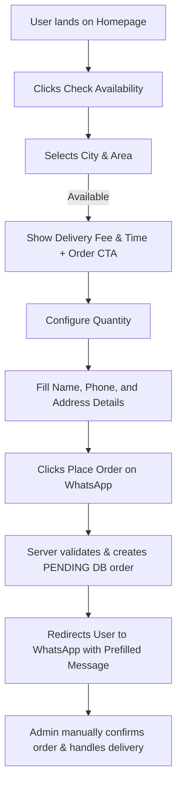

# User Journey Specifications

This document defines the step-by-step pathways for public customers, event hosts, and back-office administrators.

---

## 1. Primary Customer Journey (Available Area)

This is the core conversion path for users residing in a supported delivery zone (e.g. Bashundhara R/A, Dhaka).

### Steps:
1. **Discovery & Branding**: User visits homepage, experiences the premium product presentation, and views proof points (cleanliness, purity).
2. **Availability Verification**: User clicks "Check Availability" and selects "Dhaka" and "Bashundhara R/A".
3. **Availability Confirmation**: System displays a success state confirming delivery eligibility, a delivery fee of ৳40, and an estimated delivery window of 2–4 hours.
4. **Quantity Configuration**: User goes to the ordering form, selects unit quantity (e.g. 4 Daab), and views the instant subtotal + delivery charge breakdown.
5. **Checkout Submission**: User inputs Name, Phone number, and specific delivery directions (e.g. House, Road, Flat). 
6. **Order Placement Trigger**: User clicks the final **"Place Order on WhatsApp"** CTA.
7. **Database Record Creation**: 
    *   System validates inputs server-side.
    *   Creates a new record in `orders` with status `whatsapp_redirected`.
    *   Soft-reserves inventory.
8. **WhatsApp Handoff**: Website immediately redirects user to WhatsApp web/app prefilled with the structured order summary text.

---

## 2. Out-of-Coverage Area Journey (Waitlist Flow)

Designed to capture and aggregate prospective demand from regions Premium Daab does not currently service.

### Steps:
1. **Availability Verification**: User selects an unsupported area (e.g. "Dhaka" -> "Dhanmondi").
2. **Coming Soon State**: System displays a friendly response stating: *"Premium Daab is not available in Dhanmondi yet. We are expanding soon!"*
3. **Waitlist Opt-In**: User is presented with a simplified waitlist form requesting Name, Phone, City, and Area.
4. **Demand Collection**: User submits the form. System records the entry in the `waitlist` table.
5. **Success State**: System displays a thank-you page confirming they will be notified first as soon as service launches in their area.

---

## 3. Bulk & Events Inquiry Journey

For users requesting orders exceeding standard household quantities (more than 50 units) or mobile cart event installations.

### Steps:
1. **Inquiry Landing**: User visits the `/events` page showcasing cart setups and bulk packaging options.
2. **Details Input**: User fills out the Event Inquiry form:
    *   Event type (Corporate, Wedding, Party, Gym setup).
    *   Estimated quantity of Daab.
    *   Event Date and Location.
    *   Contact Phone and special setup instructions.
3. **Submission**: User submits the form.
    *   System records details in the `bulk_inquiries` table.
    *   Generates a dedicated WhatsApp inquiry link redirecting to the administrative WhatsApp line for customized quotation.

---

## 4. Admin Order Confirmation Workflow

All orders are confirmed and fulfilled manually by a human administrator via WhatsApp.

### Steps:
1. **Alert & View**: Admin is notified of a new order on WhatsApp. Admin logs into the Premium Daab Admin Dashboard (`/admin/login`).
2. **Order Investigation**: Admin opens the order under `/admin/orders` corresponding to the customer's order number (e.g. `PD-YYYYMMDD-XXXX`).
3. **WhatsApp Alignment**: Admin coordinates delivery time and confirms the address details directly with the customer on WhatsApp.
4. **Status Execution**: 
    *   If **Confirmed**: Admin clicks "Confirm Order". The order status changes to `confirmed`. The system permanently reduces the product's `stock_on_hand` and releases the `stock_reserved` amount.
    *   If **Cancelled**: Admin clicks "Cancel Order" and writes a cancellation note. The order status changes to `cancelled`. System releases the `stock_reserved` allocation.
5. **Log Generation**: The database logs the transition in the `order_events` and `inventory_movements` tables automatically.
