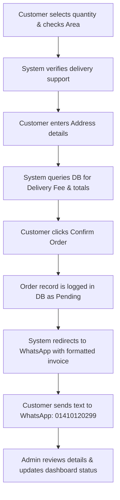

# Premium Daab — Website & Architecture Documentation

This document provides a comprehensive overview of the **Premium Daab** website architecture, its page directory, the operational workflow, admin operations, and a detailed checklist of outstanding tasks required for launching.

---

## 1. Page Directory & Architecture

The website is built using **Next.js** (utilizing the App Router with Turbopack compilation) and styled with custom Vanilla CSS. It is structured into customer-facing pages and a secure admin panel.

### Customer-Facing Pages
* **Homepage (`/`)**: 
  * The main brand showcase featuring an editorial hero section, dynamic trust badges, the brand sourcing story, packaging bundles, and a visual cart catering section.
  * Contains the **Everyday Refreshment Grid** containing 4 optimized, context-specific lifestyle WebP assets: *Morning Refreshment*, *Office Break*, *Post-Workout Hydration*, and *Guest Serving*.
  * Integrates the **Live Area Availability Checker** directly on the landing screen.
* **Product Details (`/product`)**:
  * Comprehensive showcase of the young coconut product priced at **৳120** per unit.
  * Features an interactive media carousel displaying product hero renders, left/right angles, and brand closeup details (with `product-top-straw.webp` removed in favor of `product-main.webp` table view).
  * Includes instant checkout quantity controls and case bundle links (4-Daab and 6-Daab packs).
* **Delivery Availability (`/availability`)**:
  * Standalone page hosting the **Availability Checker**. 
  * If a user's location is supported, it unlocks the order flow. If unsupported, it serves a waitlist registry form.
* **Order Checkout (`/order`)**:
  * A custom order form gathering the user's name, phone, delivery address, city, and area.
  * Dynamically queries area data in real-time from the database to calculate delivery fees and display exact totals.
* **Events & Bulk Sourcing (`/events`)**:
  * Custom inquiry form for weddings, parties, corporate catering, or custom pop-up cart bookings.
* **Our Story (`/our-story`)**:
  * Editorial page detailing the sourcing, triple-wash sanitation, custom trimming, and distribution operations.
* **FAQ (`/faq`)**:
  * An interactive accordion layout answering product questions (shelf life, packaging, and sourcing details).
* **Contact Us (`/contact`)**:
  * Support details, phone/WhatsApp number (`01410120299`), email (`Premiumdaab@gmail.com`), and delivery service area notes.

### Administrative Pages
* **Admin Login (`/admin/login`)**:
  * Secure entry portal utilizing Supabase Auth email/password credentials.
* **Admin Dashboard (`/admin`)**:
  * Analytics panel showing order summaries, revenue counts, active waitlist numbers, and area summaries.
* **Order Management (`/admin/orders` & `/admin/orders/[id]`)**:
  * Real-time order tracker. Allows operators to filter orders, view customer invoices, click direct WhatsApp chat links, and transition order states.
* **Inventory Control (`/admin/inventory`)**:
  * Live stock adjustment editor to update product availability numbers.
* **Service Areas Configuration (`/admin/areas`)**:
  * Interface to add new cities/areas and adjust individual delivery fees.

---

## 2. Admin Authentication & Operations

### Authentication Credentials
* **Database & Auth Provider**: Supabase (PostgreSQL + GoTrue Auth).
* **Admin Email / Username**: `Premiumdaab@gmail.com`
* **Administrative Allowlist**: Verification matches database profiles in the `admin_users` table to confirm `user_id` matches the session ID and has `is_active = true`.
* **Privilege Level**: Session cookies (`sb-access-token` and `sb-refresh-token`) share auth context securely between Next.js Server Components and client states, automatically blocking unauthorized entries.

### User Flow & Operations Dashboard
1. The operator logs in at `/admin/login`.
2. Once authenticated, they can manage active service areas, track new orders, update available stock, and view waitlist growth.
3. Order statuses can be transitioned through:
   `Pending` $\rightarrow$ `Preparing` $\rightarrow$ `Dispatched` $\rightarrow$ `Delivered` (or `Cancelled`).

---

## 3. The Order Fulfillment Process

The order pipeline is designed as a hybrid automated-manual system utilizing WhatsApp for direct checkout confirmation:



### Dynamic Invoice Template Sent to WhatsApp:
```text
Hello Premium Daab! 🥥
I would like to place an order.

--- Customer Details ---
Name: [Name]
Phone: [Phone]
Address: [Address], [Area], [City]

--- Order Details ---
Quantity: [Qty] x Premium Daab (৳120/unit)
Subtotal: ৳[Qty * 120]
Delivery Fee: ৳[Fee]
Total: ৳[Subtotal + Fee]

Please confirm my delivery! Thanks!
```

---

## 4. Roadmap: Outstanding Tasks

Here is the checklist of tasks remaining to make the website fully launch-ready:

### A. Marketing & Social Media Integration
- [ ] **Connect Footer & Header Social Icons**: Update mock `#` links with official Facebook, Instagram, and LinkedIn account URIs.
- [ ] **Establish Campaign Landing Pages**: If seasonal discount events (e.g., Eid promotions or office subscription bundles) are planned, establish unique promotional landing pages (e.g., `/promo/office-pack`).

### B. Messaging Trial & WhatsApp Hardening
- [ ] **Run Live Order Redirection Trials**: Conduct test checkouts across iOS Safari, Android Chrome, and Desktop browsers to verify that the WhatsApp app-switching triggers seamlessly with the pre-formatted invoice text.
- [ ] **Automate WhatsApp Notification Prompts**: Explore third-party WhatsApp Business API templates to automatically message the customer with status updates (e.g., "Your Daab has been dispatched!") when order statuses are changed in the Admin panel.

### C. Content & Blog Expansion
- [ ] **Introduce Blog Routing (`/blog`)**: Build a blogging section layout.
- [ ] **Develop Brand Concepts**: Author initial educational posts:
  * *"Why Raw Young Coconut is the Ultimate Natural Post-Workout Hydrator"*
  * *"From Orchard to Veranda: How Premium Daab Maintains Purity and Hygiene"*
  * *"Understanding Electrolytes: Why Sports Drinks Can't Beat Natural Daab"*

### D. Ads Tracking & Analytics
- [ ] **Integrate Meta Ads Pixel SDK**: Inject the tracking script to record client-side browser actions.
- [ ] **Configure Meta Conversions API (CAPI)**: Integrate server-side event sharing (triggered via server routes) to reliably track events, bypassing browser ad-blockers:
  * `ViewContent` $\rightarrow$ User views landing or product page.
  * `Search` $\rightarrow$ User performs availability area searches.
  * `InitiateCheckout` $\rightarrow$ User enters checkout page.
  * `Purchase` $\rightarrow$ User successfully triggers WhatsApp redirect button.

### E. Technical Hardening & Security
- [ ] **Configure Supabase RLS policies**: Restrict the public `anon` key from running arbitrary select queries on the `orders` or `admin_users` database tables.
- [ ] **Block Admin Route Indexing**: Update `public/robots.txt` to explicitly instruct search crawlers (like Googlebot) not to index the `/admin/*` directories:
  ```text
  User-agent: *
  Disallow: /admin/
  Disallow: /api/admin/
  ```
